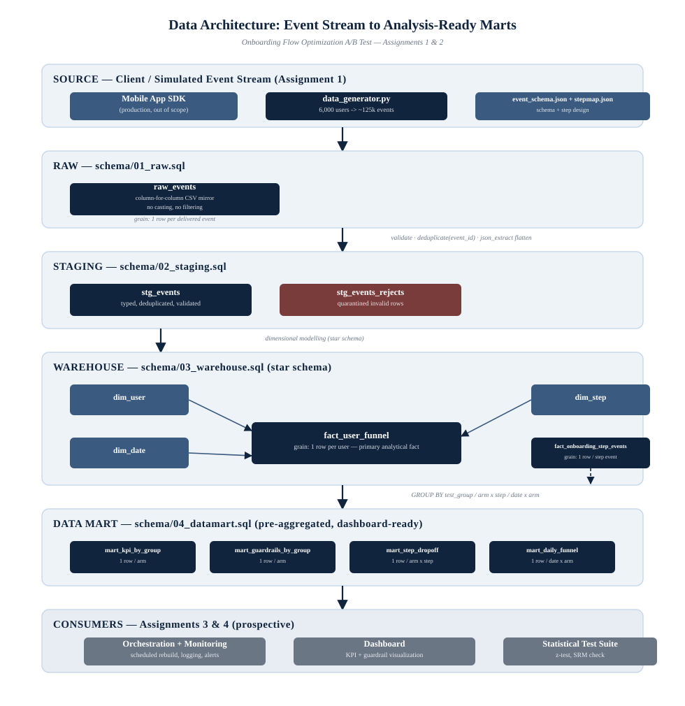
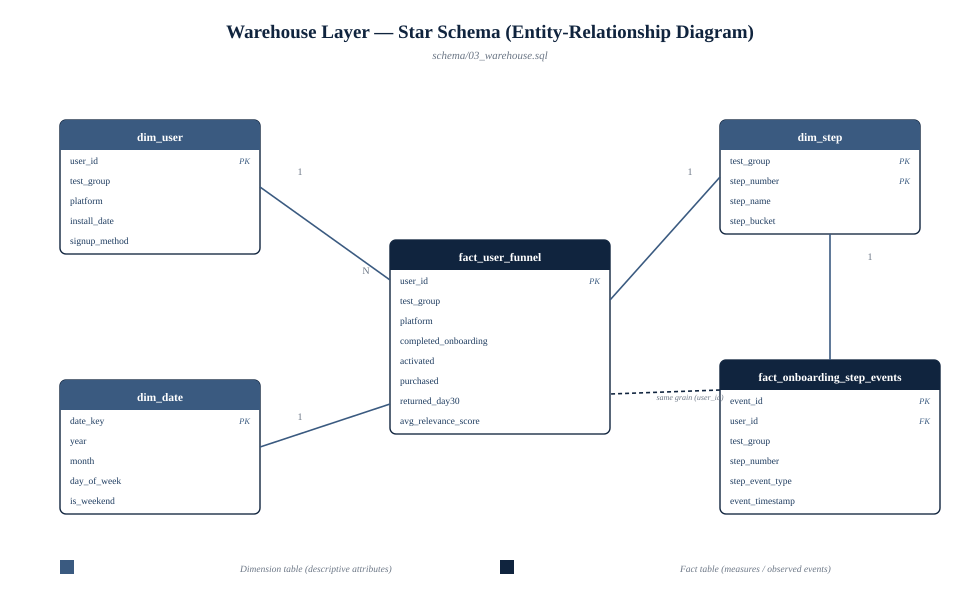

# A/B Testing Data Platform — Onboarding Flow Optimization

**Christ University | MSc Computational Statistics & Applied AI**
**Aishwarya Mishra | USN 2648610**
**Course:** Data Engineering Weekly Assignments
**Business case:** [`Onboarding_AB_Test_Experiment_Plan.pdf`](docs/Onboarding_AB_Test_Experiment_Plan.pdf) — a
3-way A/B test (13-step vs 7-step vs 5-step onboarding) for a B2C
English-learning app, testing whether trimming onboarding steps closes a
60% → 80% completion-rate gap without hurting activation, retention, or
revenue quality.

An end-to-end data pipeline — event design → ingestion → warehouse modelling
→ (pipeline automation → dashboarding, upcoming) — that turns that experiment
plan into analysis-ready data.

## Progress

| Assignment | Status | Marks |
|---|---|---|
| [1 — Business Understanding, Event Design & Data Generation](assignment1/) | ✅ Complete | 5 |
| [2 — Data Ingestion & Data Warehouse Modelling](assignment2/) | ✅ Complete | 5 |
| [3 — Pipeline Automation & Data Validation](assignment3/) | ✅ Complete | 5 |
| 4 — Analytics Dashboard & Experiment Evaluation | Not started | 5 |

## Repo Structure

```
ab-testing-data-platform/
├── README.md                          <- you are here
├── requirements.txt
├── templates/                          <- shared PDF documentation build pipeline
│   ├── style.css                       <- academic-style typesetting (cover, TOC, headers/footers)
│   └── build_pdf.py                    <- markdown -> styled PDF (pandoc + weasyprint)
├── docs/                               <- source assignment/business PDFs + rendered documentation PDFs
├── assignment1/
│   ├── 01_business_understanding.md    <- business case, hypothesis, experimental design, KPI framework
│   ├── 02_event_tracking_plan.md       <- event schema, governance, validation rules, metric lineage
│   ├── event_schema.json               <- machine-readable event schema
│   ├── stepmap.json                    <- per-variant step definitions
│   ├── data_generator.py               <- synthetic event data generator
│   ├── generated_data/events.csv       <- generated dataset (~125k events, 6k users)
│   └── README.md                       <- rubric mapping + quick start
└── assignment2/
    ├── 00_documentation.md             <- architecture, design rationale, data quality framework, results
    ├── schema/
    │   ├── 01_raw.sql
    │   ├── 02_staging.sql
    │   ├── 03_warehouse.sql
    │   ├── 04_datamart.sql
    │   └── 05_data_quality_checks.sql
    ├── build_db.py                     <- ingestion + pipeline orchestrator
    ├── db/                             <- ab_test.db built here (gitignored, regenerate locally)
    └── README.md                       <- rubric mapping + quick start
└── assignment3/
    ├── 00_documentation.md             <- error taxonomy, retry/validation/logging/monitoring/alerting design
    ├── pipeline_runner.py              <- orchestrator: retries, validation, logging, monitoring, alerting
    ├── notifier.py                     <- pluggable alert channel (console/log; email/Slack stubs)
    ├── monitor.py                      <- run-history health summary + --check for chaining
    ├── scheduler/
    │   ├── crontab.txt                 <- real production cron entry + setup notes
    │   └── scheduler_demo.py           <- pure-Python scheduler for demo / no-cron environments
    ├── logs/                           <- pipeline.log + run_history.jsonl written here (gitignored)
    └── README.md                       <- rubric mapping + quick start
```

## Quick Start

```bash
git clone <this-repo-url>
cd ab-testing-data-platform
pip install -r requirements.txt

# Assignment 1: (re)generate the synthetic event dataset
cd assignment1
python data_generator.py --n-users 6000 --seed 42 --out generated_data/events.csv

# Assignment 2: ingest + build Raw -> Staging -> Warehouse -> Data Mart
cd ../assignment2
python build_db.py

# Assignment 3: run the pipeline with automation (retries, validation,
# logging, monitoring, alerting) instead of the bare build script
cd ../assignment3
python pipeline_runner.py
```

`build_db.py` prints a data-quality report and a KPI preview at the end of
the run; `pipeline_runner.py` wraps that same build with everything
Assignment 3 adds and prints a run summary alongside it.

## Why This Approach

The business document's central question — "does trimming onboarding steps
raise completion without quietly hurting personalization, retention, or
revenue quality?" — can't be answered from a single number. It needs a
platform that:

1. **Captures every step** of the funnel and every downstream outcome at
   the event level, tagged with test group/platform/timestamp
   (Assignment 1).
2. **Lands, validates, and models** that data reliably into a queryable
   warehouse that supports the primary metric *and* every guardrail
   (Assignment 2).
3. **Runs unattended and stays trustworthy** as new data arrives —
   retrying what's worth retrying, alerting on what isn't, and leaving a
   monitorable trail of every run (Assignment 3 — this is what's built so
   far).
4. **Turns into a dashboard and a statistical verdict** — is the
   completion-rate lift real, and is it worth the guardrail trade-offs?
   (Assignment 4).

See [`assignment1/README.md`](assignment1/README.md) and
[`assignment2/README.md`](assignment2/README.md) for the detailed writeups
and rubric mapping for each piece.

## Data Architecture — How Data Moves Through This Project



Events are captured in a long, append-only format (Assignment 1), then move
through four layers (Assignment 2): **Raw** (unmodified landing) →
**Staging** (validated, deduplicated, typed) → **Warehouse** (dimensional
star schema — see the ERD below) → **Data Mart** (pre-aggregated,
dashboard-ready tables). Each arrow above corresponds to a `schema/*.sql`
file that performs exactly that transformation; nothing in this pipeline is
implicit.




Assignment 3 wraps the Assignment 2 build with retries (for transient
failures), immediate alerting (for fatal ones — bad input, bad config —
where retrying would just waste time), post-build validation against an
explicit pass/fail policy, and a monitorable history of every run. Full
error-by-error reasoning is in
[`assignment3/00_documentation.md`](assignment3/00_documentation.md)
Section 8.

Full rationale for each design decision (why this layering, why a star
schema, why this grain) is in
[`assignment2/00_documentation.md`](assignment2/00_documentation.md).
Diagram source: [`diagrams/build_diagrams.py`](diagrams/build_diagrams.py)
(regenerate with `python diagrams/build_diagrams.py`).
