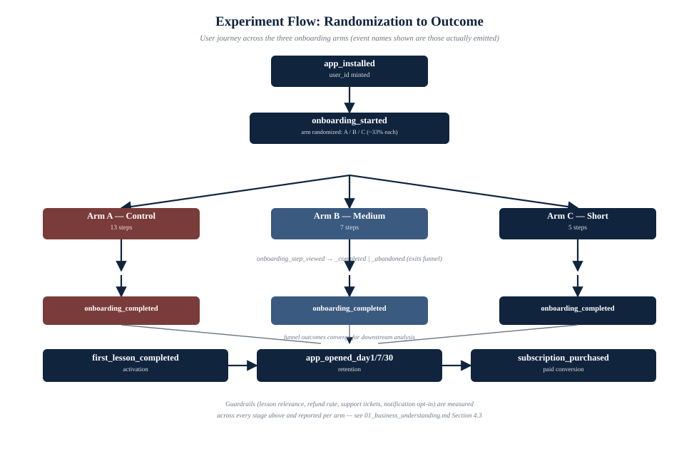

## Abstract

The organization under study operates a B2C mobile application that teaches
English using AI-driven instruction. New users are routed through a
thirteen-step onboarding sequence before reaching the core product surface.
Observed completion of this sequence (60%) trails the stated industry
benchmark (approximately 80%) by twenty percentage points, while the
downstream paid-conversion rate of users who *do* complete onboarding (6%)
is in line with industry norms. This document establishes the business
case, the causal hypothesis under test, the experimental design used to
test it, and the KPI/guardrail framework against which the experiment's
result will be judged. It is the analytical foundation for the data
platform built in Assignments 2 through 4; every metric defined here maps
onto a concrete column or aggregation in the warehouse and data mart layers
described in Assignment 2.

## 1. Introduction and Business Context

### 1.1 Product and User Journey

The product is a mobile, subscription-based English-language learning
application. A new user's journey has three phases: (i) **acquisition** —
the user installs the app, typically via paid or referral channels; (ii)
**onboarding** — a sequence of account-creation, assessment, and
preference-capture steps that precede any exposure to the core
product; and (iii) **engagement and monetization** — lesson consumption,
retention, and eventual conversion to a paid subscription. This assignment,
and the platform it specifies, is concerned with phase (ii) and its causal
effect on phase (iii).

### 1.2 Problem Statement

Every additional step interposed between install and first product value is
an additional point of attrition. Because acquisition is typically a paid
activity (advertising spend, referral incentives), attrition inside
onboarding is economically distinct from attrition earlier in the funnel:
it represents a loss of *already-paid-for* users, not a failure to acquire.
The organization's stated position is that its current thirteen-step flow
is the primary driver of the observed 20-percentage-point completion gap
relative to industry benchmarks, and that the checkout/monetization
mechanics downstream of onboarding are *not* the problem, since paid
conversion of the users who do complete onboarding already matches industry
norms.

### 1.3 Opportunity Sizing

Using the organization's illustrative planning assumptions — 100,000 new
users entering onboarding per month, and $30 average monthly revenue per
paying user — the revenue impact of closing the completion gap can be
expressed as a simple identity:

```
Monthly Revenue = Users_Started x Completion_Rate x Paid_Conversion_Rate x ARPU
```

| Scenario | Completion Rate | Users Completing | Paying Users (@6%) | Monthly Revenue |
|---|---|---|---|---|
| Current state | 60% | 60,000 | 3,600 | $108,000 |
| Industry-benchmark state | 80% | 80,000 | 4,800 | $144,000 |
| **Delta** | **+20 pp** | **+20,000** | **+1,200** | **+$36,000/mo (~$432,000/yr)** |

This identity makes explicit the assumption the experiment is designed to
test: that `Completion_Rate` can be moved by intervention on onboarding step
count *without* a compensating decrease in `Paid_Conversion_Rate` or ARPU —
i.e., that the funnel stages are not causally entangled through some
confound such as user quality or personalization depth. Section 5 (Guardrail
Metrics) exists specifically to detect a violation of that assumption.

## 2. Hypothesis

**Primary hypothesis (H1):** Reducing the number of sequential onboarding
steps from thirteen will causally reduce onboarding attrition, increasing
the onboarding completion rate, and this effect will propagate (at least
partially) into activation and paid-conversion volume, because a fixed
downstream conversion rate applied to a larger completing population yields
more paying users in absolute terms.

**Identification concern:** A naive test of "shorter onboarding is better"
conflates two distinct manipulations — *how many* steps a user must pass
through, and *which* steps are removed. If the removed steps happen to be
ones that meaningfully improve personalization or set correct user
expectations, an observed lift in completion could co-occur with a decline
in downstream quality, and the experiment would misattribute a
compositional effect to a pure friction effect. The design in Section 3
addresses this by deliberately holding a "must-have" step set constant
across all three variants and manipulating only the "can-wait" and
"nice-to-have" tiers (see Table 3.1), so any observed guardrail movement can
be attributed to *specific, named* removed steps rather than to step count
in the abstract.

**Null hypothesis (H0):** Onboarding step count has no causal effect on
completion rate within the range tested (5–13 steps); observed differences
between arms are attributable to sampling variation.

## 3. Experimental Design

### 3.1 Design Summary

| Parameter | Value |
|---|---|
| Design type | Three-arm, between-subjects, randomized controlled trial |
| Randomization unit | Individual user, at first app open |
| Assignment mechanism | Uniform random draw, ~33.3% per arm |
| Stratification | Platform (iOS / Android), balanced within each arm |
| Primary endpoint | Onboarding completion rate |
| Secondary endpoints | Activation rate, D1/D7 return, paid conversion rate, time-to-first-lesson |
| Guardrail endpoints | Lesson relevance score, D30 return, refund rate, support-ticket rate, notification opt-in rate |
| Platform coverage | iOS and Android, balanced |

### 3.2 Arms

| Arm | Label | Step Count | Design Intent |
|---|---|---|---|
| A | Control | 13 (unchanged) | Establishes the observational baseline; no product change |
| B | Medium | 7 | Tests a moderate reduction, retaining most "can-wait" steps |
| C | Short | 5 | Tests an aggressive reduction, retaining only "must-have" steps |



*Figure 1. Every event named above is emitted verbatim by the instrumentation
in the event tracking plan (Section 5); the three arms diverge only in step
count immediately after randomization and converge again into a shared
measurement path.*

### 3.3 Step Classification (Confound Control)

Each of the thirteen steps in the master flow is classified into exactly one
of three buckets, and this classification — not an ad hoc truncation of the
step list — determines what each arm removes:

| Bucket | Definition | Treatment across arms |
|---|---|---|
| **Must-have** | Structurally required before an account exists or a lesson can be served (e.g., account creation, level assessment) | Present in A, B, and C |
| **Can-wait** | Useful, but deferrable to after the user has experienced product value | Present in A and (partially) B; deferred or omitted in C |
| **Nice-to-have** | Marginal value; combinable into other surfaces or removable with limited loss | Present only in A |

This scheme means B and C are not simply "the first *k* steps of A" — they
are principled subsets, so a completion-rate difference between A and C can
be decomposed, at least partially, into "steps removed because they were
nice-to-have" versus "steps removed because they were merely deferred,"
supporting a more defensible causal claim than step-count alone would allow.
The full step-to-bucket-to-arm mapping is version-controlled as data
(`stepmap.json`) rather than hard-coded in analysis scripts, so it can be
audited and reused identically by the data generator (Assignment 1), the
warehouse (Assignment 2), and the dashboard (Assignment 4).

### 3.4 Sample Size and Power (Design-Stage Reasoning)

Although this assignment uses simulated rather than production traffic, the
design is specified as if for production: with a baseline completion rate
of 60% and a targeted minimum detectable effect (MDE) of 5 percentage
points at alpha = 0.05 (two-sided) and 80% power, a two-proportion z-test
requires approximately 1,450-1,500 users per arm. At the illustrative
volume of 100,000 new users/month split three ways, this sample size is
reached within hours of launch, meaning the primary metric is not
statistically under-powered; the binding constraint on run duration is
instead the guardrail metrics with lower base rates (e.g., refund rate,
support-ticket rate), which require materially larger samples and a longer
observation window (the D30 guardrail alone requires at least a 30-day
observation tail per cohort). Assignment 4 will apply this reasoning against
the actual generated sample.

### 3.5 Threats to Validity and Mitigations

| Threat | Description | Mitigation in this design |
|---|---|---|
| Sample Ratio Mismatch (SRM) | Unequal realized allocation across arms indicates a broken randomizer or differential instrumentation loss | `mart_kpi_by_group` reports raw `users_started` per arm for an SRM check before any effect is interpreted (Assignment 4) |
| Novelty effect | Short-term behavioral change due to novelty of a new flow, not a durable effect | D30 return is tracked specifically to distinguish durable retention from a novelty spike |
| Instrumentation asymmetry | If variant-specific code paths log events differently, metrics become incomparable | All three arms share one event schema (Assignment 1, Section on Event Catalog); no variant-specific event types exist |
| Interference / network effects | Not applicable at this scale; users of a language-learning app do not materially interact with one another inside the product | Not mitigated further; assumed negligible |
| Multiple comparisons | Testing one primary + four secondary + five guardrail metrics inflates false-positive risk across the full metric set | Primary metric is pre-registered as the sole basis for the ship/no-ship decision; guardrails are interpreted as a directional risk check, not independently hypothesis-tested, in Assignment 4 |

## 4. KPI Framework

### 4.1 Primary Metric

**Onboarding completion rate** — the proportion of users who start
onboarding and reach `onboarding_completed`.

```
Completion Rate = COUNT(DISTINCT user_id WHERE onboarding_completed)
                 / COUNT(DISTINCT user_id WHERE onboarding_started)
```

This is the sole metric on which the ship/no-ship decision is made. It is
chosen as primary — rather than, say, paid conversion — because it is the
metric closest to the mechanism under test (step count) and least
confounded by downstream factors (pricing, payment friction) outside this
experiment's scope.

### 4.2 Secondary (Supporting) Metrics

| Metric | Formal Definition | Business Purpose |
|---|---|---|
| Activation rate | `first_lesson_completed` users divided by `onboarding_completed` users | Confirms completers are engaging with the product, not merely clicking through a shorter flow without absorbing it |
| Day-1 / Day-7 return rate | Users with `app_opened_dayN` divided by `onboarding_completed` users | Early behavioral signal of retained interest |
| Paid conversion rate | `subscription_purchased` users divided by `first_lesson_completed` users | Connects the funnel to revenue; expected to remain flat across arms under H1 |
| Time to first lesson | `first_lesson_started.timestamp - onboarding_started.timestamp` | Direct, continuous measure of friction removed; complements the binary completion metric |

### 4.3 Guardrail Metrics

Guardrails exist to detect the identification concern in Section 2: that a
completion-rate lift purchased by removing personalization-relevant steps
could be a false economy.

| Guardrail | Formal Definition | Failure Mode It Detects |
|---|---|---|
| Lesson relevance score | Mean of self-reported `relevance_score` (1-5) on `lesson_feedback_submitted` | Fewer personalization questions leads to generic content and user dissatisfaction not visible in completion rate |
| Day-30 return rate | Users with `app_opened_day30` divided by `onboarding_completed` users | Shorter flow could admit low-intent users who complete easily but churn once novelty fades |
| Refund rate | `refund_requested` users divided by `subscription_purchased` users | Rushed onboarding leads to a user misunderstanding what was purchased |
| Onboarding-related support-ticket rate | Users with `support_ticket_created` (onboarding-tagged) divided by `onboarding_started` users | A skipped explanatory step (billing, permissions) manifests as downstream confusion |
| Notification opt-in rate | Users with `notification_permission_accepted` divided by users with `notification_permission_shown` | If the permission step is deferred out of the primary flow, opt-in typically falls, weakening future re-engagement capacity |

### 4.4 Metric Governance

No guardrail is a hard stop encoded in the platform itself; each is
surfaced to the analyst in the Assignment 4 dashboard alongside the primary
metric, with the interpretive judgment (ship, ship-with-mitigation, or
hold) left to human decision-makers. This is a deliberate design choice:
automatically gating a launch decision on five simultaneously-measured
guardrails, each with its own base-rate noise, would itself introduce a
multiple-comparisons problem the design in Section 3.5 explicitly avoids
compounding.

## 5. Assumptions and Limitations

1. **Simulated, not production, data.** The dataset analyzed in Assignments
   2-4 is synthetically generated (see `data_generator.py`) to match the
   funnel shape and guardrail directions implied by this document, since
   production instrumentation does not yet exist. Effect sizes in the
   simulated data are illustrative, calibrated to be directionally
   consistent with the business hypothesis, not empirically estimated from
   real users.
2. **Flat paid-conversion assumption.** The opportunity-sizing model in
   Section 1.3 assumes `Paid_Conversion_Rate` is invariant to onboarding
   step count. This is the assumption under test, not a given; if guardrail
   analysis in Assignment 4 shows it does not hold, the revenue estimate in
   Section 1.3 is an upper bound, not a forecast.
3. **Single-app, single-market scope.** No geographic, language-cohort, or
   platform-version stratification beyond iOS/Android is modeled. Effects
   may not generalize across markets with different device mixes or
   payment norms.
4. **No network or peer effects modeled**, consistent with the product's
   single-player usage pattern.
5. **Guardrails are directional signals, not hypothesis tests**, per
   Section 4.4; this document does not claim statistical significance for
   guardrail movements, only that the platform is instrumented to detect
   them.

## 6. Data Platform Requirement

Testing H1 while respecting the guardrails in Section 4.3 requires a
pipeline capable of: (i) capturing every funnel and product event at
user-level granularity, tagged with arm, platform, and timestamp; (ii)
validating and landing that data reliably even in the presence of
malformed or duplicate delivery; (iii) modeling it into a warehouse that
supports both the primary metric and every guardrail without ad hoc
re-querying of raw events; and (iv) serving it to a dashboard and a
statistical test suite. These four requirements map directly onto
Assignments 1-4 respectively; Assignment 2 (immediately following)
implements (ii) and (iii).

See [`02_event_tracking_plan.md`](02_event_tracking_plan.md) for the event
schema and governance model, and [`data_generator.py`](data_generator.py)
for the synthetic dataset used to develop and validate the pipeline ahead
of real production traffic.
