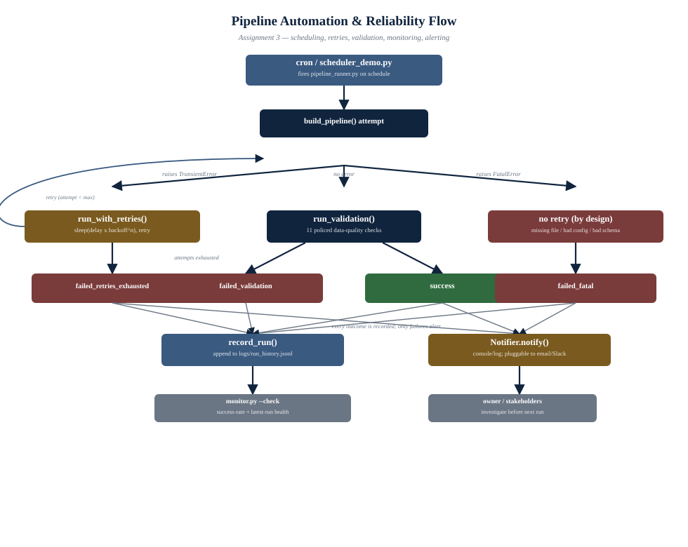
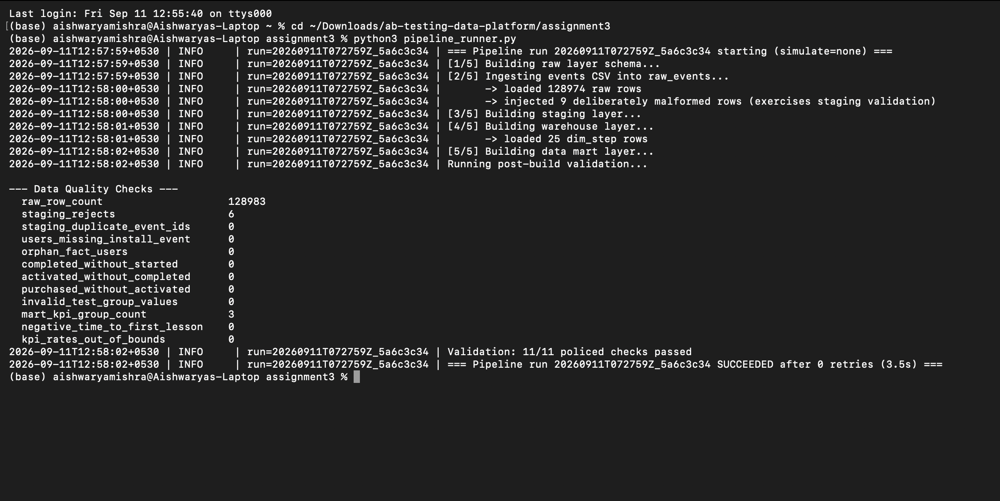
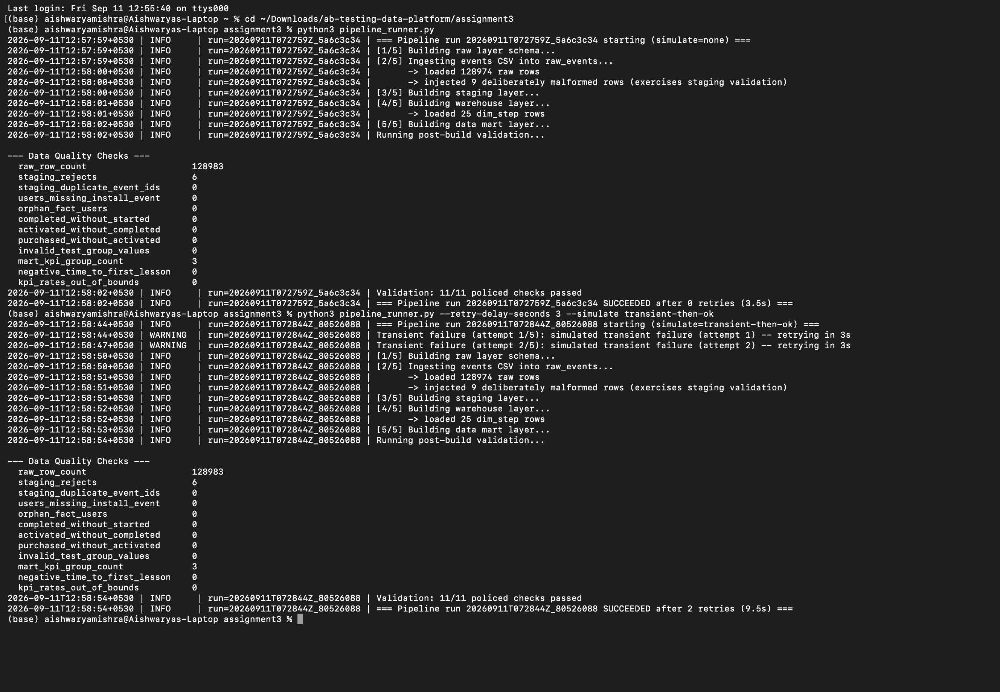
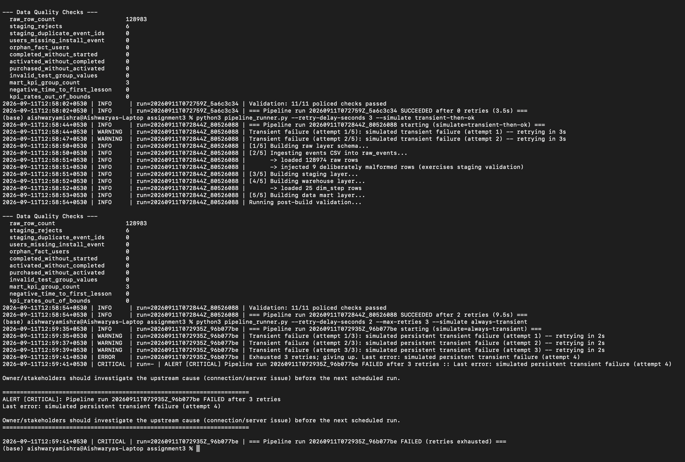
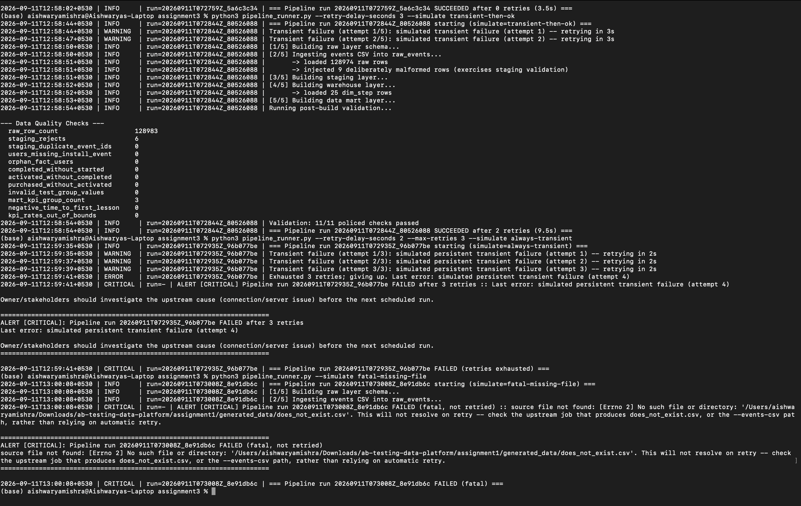
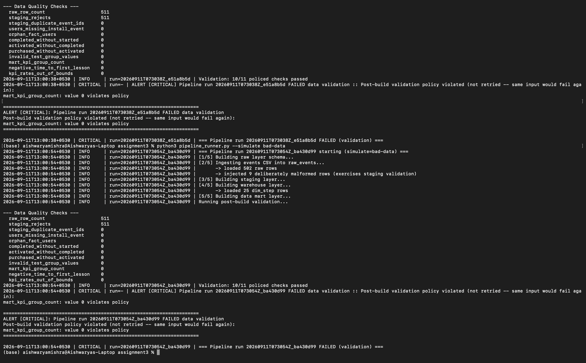
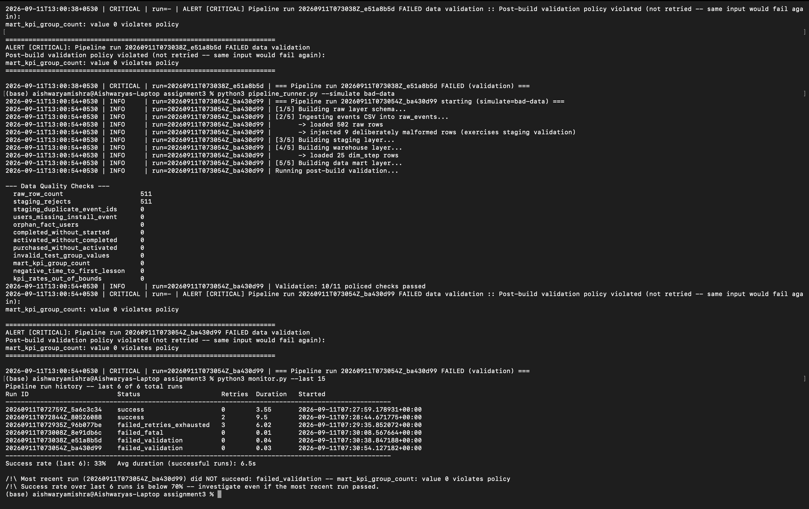

## Abstract

Assignment 2 produced a working, correct pipeline that a human runs by
typing `python build_db.py`. This assignment removes the human from that
loop: the pipeline runs on a schedule, classifies its own failures,
retries the ones worth retrying, alerts an owner on the ones that aren't,
validates its own output against a policy before calling itself
successful, and leaves behind a queryable history of every run so a
person (or another automated check) can tell how the pipeline has been
doing without reading raw logs. None of Assignment 2's SQL changes; this
assignment wraps it.

## 1. What "Automate the Pipeline" Actually Requires



*Figure 1. Control flow through `pipeline_runner.py`, from the scheduler
trigger to the final alert or monitoring record. The left branch is the
retry loop (transient errors); the right branch is the immediate-alert
path (fatal errors); the center branch is the success/validation path.*


Turning a manually-run script into an unattended pipeline is not just
"put it in cron." A script that only ever ran once, by a person watching
the terminal, gets four things for free that an unattended job does not:
a human notices if it didn't finish, a human notices if the output looks
wrong, a human can just re-run it if something transient went wrong, and
a human remembers roughly how it's been going lately. Automation has to
replace all four of those, explicitly:

| What a human provided | What replaces it here |
|---|---|
| Notices the job didn't finish | Structured logging (Section 3) + a rotating log file |
| Notices the output looks wrong | An explicit, executable validation policy (Section 4) run after every build |
| Re-runs it if something transient failed | Automatic retry with backoff, but *only* for errors classified as worth retrying (Section 2) |
| Remembers how it's been going | A monitoring history file and a summary tool (Section 5) |
| Escalates if it's actually broken | A pluggable Notifier invoked on any terminal failure (Section 6) |

## 2. Error Taxonomy: Retry vs. Alert

The assignment brief's own example — "if there is a connection error or
server error, retry after 5 minutes... or notify the owner" — already
implies a classification the naive version of automation skips: **not
every failure should be retried**. Retrying a failure caused by bad input
data just re-produces the same bad output five times before giving up,
burning the retry budget and delaying the alert for no benefit. This
pipeline draws the line explicitly with two exception types
(`pipeline_runner.py`):

| | `TransientError` | `FatalError` |
|---|---|---|
| Meaning | The same operation might succeed with no other change | The operation will fail identically until something is fixed |
| Examples in this pipeline | SQLite `OperationalError` (lock contention, momentary I/O issue) | Missing source CSV; malformed `stepmap.json`; a policed data-quality check failing |
| Handled by | `run_with_retries()` — sleep and retry, up to `--max-retries` | Propagates immediately to the alerting path, no retry attempted |
| Why | The pipeline's full-rebuild design (Assignment 2, Section 4) makes a clean retry safe and cheap | Retrying costs time and retry budget while producing an identical failure and an identical, uninformative alert |

An exception that doesn't match either known type is treated as **fatal
by default**, not silently retried — an unclassified error might indicate
a bug in the pipeline itself, and retrying blindly could mask that rather
than surface it. The taxonomy is meant to grow: `pipeline_runner.py`'s
`except Exception` fallback logs and alerts with an explicit note that the
error type should be classified, rather than pretending to have handled
it correctly.

### 2.1 Retry Mechanics

`run_with_retries()` implements the "retry after 5 minutes... limit of 5
retries" policy from the brief directly: `--max-retries` (default 5) and
`--retry-delay-seconds` (default 300 = 5 minutes) are both configurable,
and a `--backoff` multiplier (default 1.0, fixed-interval) can be set
above 1.0 for exponential backoff (5 min, 10 min, 20 min, ...) if a
transient condition is more likely to need longer to clear than a fixed
interval assumes. Each retry attempt re-runs the *entire* build from
scratch, not just the failed step — safe and correct specifically because
Assignment 2's ingestion is idempotent (drop-and-rebuild), so a partial
prior attempt leaves no state a retry needs to clean up first.

## 3. Logging

`pipeline_runner.py` configures Python's standard `logging` module once
per run, with two handlers sharing one format
(`timestamp | level | run=<run_id> | message`):

- A `RotatingFileHandler` (`logs/pipeline.log`, 5 MB per file, 5 files
  retained) — durable, doesn't grow unbounded, survives past the process
  exiting.
- A console `StreamHandler` — visible immediately in an interactive run
  or in cron's own captured output.

Every log line carries a `run_id` (a timestamp plus a short random
suffix), so a specific run's complete history can be isolated with
`grep run=<run_id> logs/pipeline.log` even though all runs share the same
rotating file — chosen over one-file-per-run specifically so log volume
stays bounded regardless of how many times the job has fired.

## 4. Validation

Reuses Assignment 2's own data-quality checks
(`schema/05_data_quality_checks.sql`) rather than inventing a second,
possibly-inconsistent set — but adds something Assignment 2 did not have:
an explicit, executable **pass/fail policy** (`VALIDATION_POLICY` in
`pipeline_runner.py`) that decides which check results are acceptable.
Assignment 2 printed twelve numbers for a human to read; Assignment 3
decides, in code, whether those numbers mean the run succeeded.

Eleven of the twelve checks are policed (must equal an expected value, or
satisfy a bound); `staging_rejects` is deliberately **not** policed,
because a non-zero count there is expected and desired (Assignment 2,
Section 5.1 — it's how the validation logic's own effectiveness gets
verified). Encoding that distinction as a real policy, not a comment,
means a genuine regression — say, a future schema change that silently
lets `orphan_fact_users` go non-zero — fails the pipeline run loudly
instead of printing an ignored number.

A validation failure raises `ValidationFailure` (a subtype of
`FatalError`, Section 2): the same input data would fail the same way on
a retry, so it goes straight to alerting rather than into the retry loop.

## 5. Monitoring

Every run — success or failure, however it failed — appends one JSON
record to `logs/run_history.jsonl`: `run_id`, start/end timestamps,
duration, `status`, `retries_used`, the validation summary (on success),
and the error (on failure). This is deliberately separate from the
logging file in Section 3: logging answers "what happened inside this one
run, step by step" (for debugging one incident); monitoring answers "how
has the pipeline been doing across many runs" (for a health check that
doesn't want to parse prose log lines).

`monitor.py` reads that history and reports: a table of recent runs, the
success rate over a configurable window, and average duration of
successful runs. Its `--check` flag exits non-zero if the *most recent*
run failed, or if the success rate over the last five-plus runs drops
below 70% even when the latest run happened to pass — catching a pipeline
that's flapping (intermittently failing) and not just one that's
currently down. That exit code is designed to be chained: a second cron
entry (Section 7) runs `monitor.py --check` independently of
`pipeline_runner.py`'s own alerting, so a bug in the runner's alerting
path doesn't silently remove the *only* signal that something is wrong.

## 6. Alerting

`notifier.py` defines a `Notifier` interface with one method,
`notify(subject, message, severity)`. The default, `LogNotifier`, writes
the alert through the same structured logger as everything else (at
`CRITICAL`) and to stdout — meaning it works with zero external
configuration, which matters for a coursework deliverable graded by
someone who won't have SMTP credentials or a Slack workspace to hand.
`EmailNotifier` and `SlackWebhookNotifier` implement the same interface
against real channels, shown to demonstrate the extension point rather
than wired to live credentials; swapping one in for production is a
one-line change (`notifier = EmailNotifier(...)` in `main()`), not a
redesign. `MultiNotifier` fans one alert out to several channels at once,
for a real deployment that wants both a log entry and a page.

`pipeline_runner.py` calls the notifier exactly once per failed run, with
a message specific to *why* it failed (which check violated policy; which
file was missing; how many retries were exhausted) — an alert that just
says "pipeline failed" sends the on-call person straight to the logs
anyway, so the alert itself carries the diagnosis where it's known at
alert time.

## 7. Scheduling

Two scheduling mechanisms are provided, aimed at two different needs:

- **`scheduler/crontab.txt`** — the real answer for a production or
  graded-as-deployed system: a standard cron entry running
  `pipeline_runner.py` daily, plus a second, offset entry running
  `monitor.py --check` independently (Section 5). Documented with the
  caveat that actually matters in practice: cron's environment is
  minimal (no `PATH`, no shell profile), so every path in the crontab
  entry is absolute — a script that works fine when run by hand and then
  mysteriously "does nothing" under cron is almost always this.
- **`scheduler/scheduler_demo.py`** — a pure-Python scheduler (the
  `schedule` library) for environments without OS cron access, or for
  demonstrating the schedule actually firing without waiting until 2 AM:
  `--demo-interval-seconds 15` runs the job every fifteen seconds instead
  of daily, so the retry/validation/alerting behavior in Sections 2–6 can
  be watched live in one terminal.

## 8. Reliability: Failure Scenarios Considered

The assignment brief's own example (connection/server error → retry, then
alert after N failures) is one instance of a broader question: *what can
actually go wrong, and for each, is retrying the right response?* This
table is the "think more cases like this" the brief asks for.

| Scenario | Classification | Why |
|---|---|---|
| Database locked / momentary I/O error | Transient — retry | SQLite lock contention typically clears within seconds; the full-rebuild design makes a retry safe |
| Simulated "connection/server error" (the brief's own example) | Transient — retry, then alert after `--max-retries` | Directly implements the brief's example via `--simulate always-transient` |
| Source CSV missing | Fatal — alert immediately, no retry | Will not resolve itself; retrying just delays discovering the upstream job didn't produce its output |
| `stepmap.json` missing or malformed | Fatal — alert immediately | A config/code error, not an environmental blip |
| Data-quality policy violated (e.g. `mart_kpi_group_count != 3`) | Fatal (`ValidationFailure`) — alert immediately, no retry | Re-running against the same bad input produces the same bad output |
| Duplicate `event_id` in source | Not fatal — staging already deduplicates (Assignment 2, Section 3.2); the pipeline succeeds, and `staging_duplicate_event_ids` stays 0 in the *warehouse* even though it exists in raw | Handled by design, not by this layer |
| Disk full / cannot write database file | Transient in principle (space may free up), but capped by the same retry limit as any other transient error so it still escalates to an alert rather than retrying forever | Retrying indefinitely on a persistent condition is itself a reliability bug |
| Pipeline killed mid-run (e.g. host restart) | No partial-state hazard on the next run | Idempotent full-rebuild design (Assignment 2) means the next scheduled run starts clean regardless of where the previous one stopped |
| Two runs overlap (previous run still going when the next is scheduled) | Not yet handled | Named explicitly in Section 9 (Limitations) rather than silently ignored — see below |
| Unclassified / unexpected exception type | Fatal by default, not retried | Avoids masking a real bug behind an automatic retry; surfaces in the alert with a note to add it to the taxonomy |

## 9. Assumptions and Limitations

1. **No overlap/locking guard between scheduled runs.** If a run is still
   in progress when the next scheduled trigger fires (e.g. an
   unusually slow run coinciding with the next day's 2 AM trigger), both
   could execute against the same SQLite file concurrently. A production
   version would take a lock file (or a proper job-scheduling system's
   built-in overlap prevention) before starting; this coursework version
   assumes runs complete well within the scheduling interval, consistent
   with observed run durations (Section 10) of a few seconds against the
   current data volume.
2. **Retry delay is fixed per run, not adaptive.** `--backoff` supports
   exponential growth, but nothing currently distinguishes "this
   particular transient error usually clears in seconds" from "this one
   usually takes minutes" — every transient error gets the same delay
   curve.
3. **The Notifier's real channels (email, Slack) are unconfigured
   stubs**, per Section 6 — intentional for a credential-free coursework
   deliverable, not a gap in the interface design.
4. **Monitoring history has no retention policy.** `run_history.jsonl`
   grows by one line per run indefinitely; a long-running deployment
   would want to roll it over (mirroring the rotating log handler in
   Section 3), which this version does not yet do.

## 10. Observed Behavior

Four scenarios were run against the live pipeline to confirm each path in
Section 8 actually behaves as designed (`--simulate` flag,
`pipeline_runner.py`):

| Simulated condition | Command | Observed outcome |
|---|---|---|
| Normal run | `pipeline_runner.py` | Succeeded, 0 retries, ~3s, all 11 policed checks passed |
| Transient failure that clears | `--simulate transient-then-ok` | 2 `WARNING` retries logged, succeeded on 3rd attempt |
| Persistent transient failure | `--simulate always-transient --max-retries 3` | 3 retries logged, then `failed_retries_exhausted`, alert fired |
| Missing source file | `--simulate fatal-missing-file` | Failed immediately, 0 retries, alert fired, message names the missing file |
| Corrupted input data | `--simulate bad-data` | Build succeeded structurally, but `run_validation()` caught `mart_kpi_group_count` violating policy; failed immediately, 0 retries, alert names the specific check |

All five runs were recorded correctly in `logs/run_history.jsonl`, and
`monitor.py` correctly reported the resulting mixed success rate and
flagged the most recent failing run — confirming Sections 2 through 6
function as an integrated whole, not just as isolated units.

## 11. Execution Evidence

The screenshots below are direct, unedited terminal captures taken while
running this codebase locally (`(base) aishwaryamishra@Aishwaryas-Laptop`),
not retyped or synthesized. Several capture more than one command in a
single scrollback, in the order they were actually run.

### 11.1 Normal Run



*`python3 pipeline_runner.py` with no flags: raw ingestion through
data-mart build, the data-quality check output inherited from
Assignment 2, and the validation-policy verdict (Section 4) that turns
those checks into a pass/fail decision. Succeeded after 0 retries in 3.5s.*

### 11.2 Transient Failure That Recovers



*Continuing the same session, `--simulate transient-then-ok`: the first
two attempts raise `TransientError` and are logged as `WARNING`, not
`ERROR` — a retry still within budget is an expected, non-alarming event.
The third attempt succeeds; the run completes with `retries_used=2`
recorded in the monitoring history.*

### 11.3 Retries Exhausted → Alert



*`--simulate always-transient --max-retries 3`: three `WARNING`-level
retries, then an `ERROR` when the retry budget is exhausted, then the
`Notifier`'s `CRITICAL` alert — printed here via the default
`LogNotifier` (Section 6), the same call site that would instead page an
on-call engineer if `EmailNotifier` or `SlackWebhookNotifier` were
configured.*

### 11.4 Fatal Error — No Retry



*`--simulate fatal-missing-file`: no `WARNING` lines at all — a missing
file is classified `FatalError` (Section 2) and goes straight to the
alert, naming the exact path it looked for
(`/Users/aishwaryamishra/Downloads/ab-testing-data-platform/assignment1/generated_data/does_not_exist.csv`)
rather than retrying an identical failure five times before saying
anything useful.*

### 11.5 Validation Failure — No Retry



*`--simulate bad-data`, run twice: this is the scenario that most
distinguishes this design from a naive "retry everything" pipeline. The
build succeeds mechanically — SQL runs, tables populate — but
`run_validation()` (Section 4) catches that `mart_kpi_group_count`
violates policy and raises `ValidationFailure` before the run can be
called successful. The alert names the specific check that failed, not
just "something went wrong," and — correctly — neither run retried.*

### 11.6 Monitoring: Health Summary Across Runs



*`monitor.py --last 15` after the five scenarios above: every outcome —
both successes, both failure types, and the retry-exhaustion case —
appears as one row each, pulled straight from `logs/run_history.jsonl`.
Because the most recent run at that point had failed validation, both
alerts fire: the per-run "did not succeed" flag *and* the "success rate
below 70%" flag (Section 5) — exactly the two-layer signal that check is
designed to give.*

## 12. How to Run

```bash
# Normal run
python pipeline_runner.py

# Demonstrate retry-then-succeed
python pipeline_runner.py --retry-delay-seconds 2 --simulate transient-then-ok

# Demonstrate retries exhausted -> alert
python pipeline_runner.py --retry-delay-seconds 2 --max-retries 3 --simulate always-transient

# Demonstrate a fatal (non-retried) failure
python pipeline_runner.py --simulate fatal-missing-file
python pipeline_runner.py --simulate bad-data

# Check pipeline health
python monitor.py
python monitor.py --check   # exit 1 if unhealthy, for chaining

# Watch the scheduler actually fire, without waiting for 2am
python scheduler/scheduler_demo.py --demo-interval-seconds 15 --retry-delay-seconds 2
# Regenerate the Section 11 evidence screenshots from fresh captures
python render_terminal_screenshots.py
```

See [`../diagrams/pipeline_reliability_flow.svg`](../diagrams/pipeline_reliability_flow.svg)
for the full control-flow diagram, and the
[repository root README](../README.md) for how this fits into the
four-assignment pipeline.
