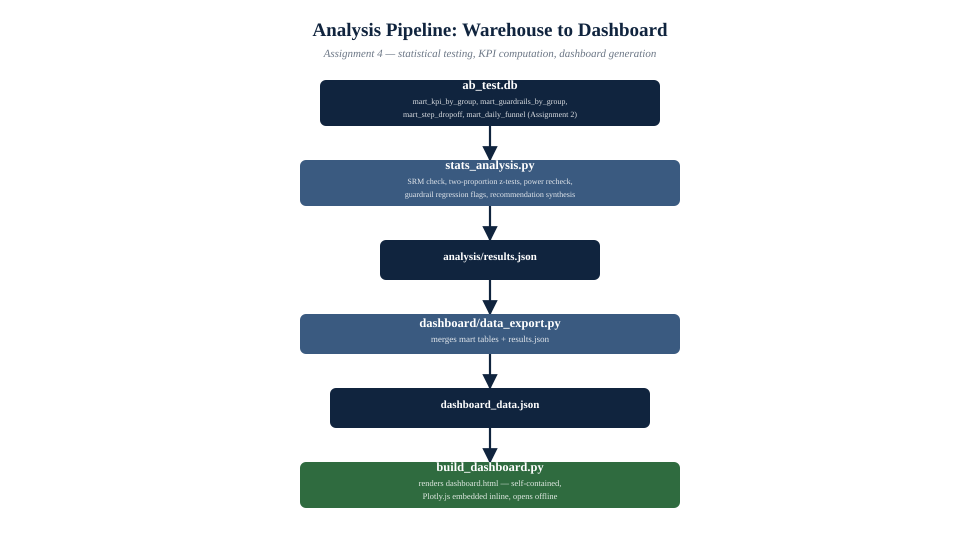
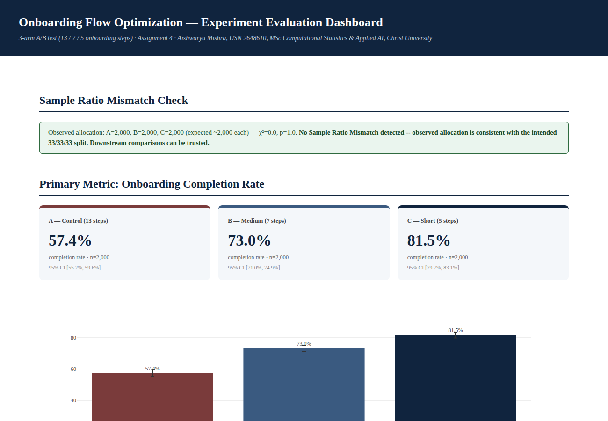
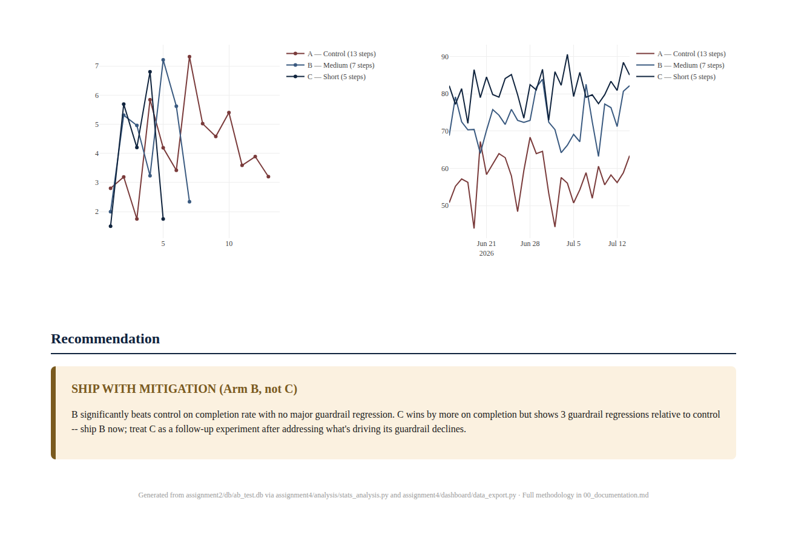

## Abstract

Assignments 1–3 built the platform; this assignment answers the question
that platform exists to answer: did shortening onboarding actually work,
and is it worth shipping? This document computes the primary and
secondary KPIs from the Assignment 2 data mart, runs the hypothesis test
the Assignment 1 experimental design specifies (Section 3), checks the
result against every guardrail defined in that same document, and
synthesizes a single ship/hold recommendation from all of it —
distinguishing, throughout, between what is statistically confirmed and
what is merely a directional signal, per the metric-governance model
Assignment 1 already committed to.



*Figure 1. `stats_analysis.py` computes every statistic once, in one
place, and writes it to `results.json`; `data_export.py` merges that with
the raw mart tables into `dashboard_data.json`; `build_dashboard.py`
renders the whole thing into one self-contained HTML file with Plotly.js
embedded inline, so `dashboard.html` opens and works fully offline —
double-click it, no server, no internet connection required.*

## 1. KPI Computation

Every KPI here is read directly from the Assignment 2 data mart
(`mart_kpi_by_group`, `mart_guardrails_by_group`) rather than
re-aggregated from raw events — the whole point of that layer (Assignment
2, Section 2.4) was to make this step a lookup, not a re-derivation.

| KPI | Value — A | Value — B | Value — C |
|---|---|---|---|
| Onboarding completion rate (primary) | 57.4% | 73.0% | 81.5% |
| Activation rate | 69.8% | 63.2% | 65.6% |
| Day-1 return rate | 55.8% | 54.4% | 55.5% |
| Day-7 return rate | 42.7% | 40.1% | 42.1% |
| Day-30 return rate (guardrail) | 36.2% | 34.3% | 29.0% |
| Paid conversion rate | 6.1% | 5.7% | 6.3% |
| Avg. time to first lesson | 1,584s | 1,507s | 1,476s |

The pattern is exactly what Assignment 1's opportunity-sizing model
(Section 1.3) hoped for on the primary metric — completion rate rises
monotonically as step count falls — and exactly what its identification
concern (Section 2) warned to watch for on the guardrails: Day-30 return
declines as the flow shortens, most sharply for C.

## 2. Statistical Testing

### 2.1 Precondition: Sample Ratio Mismatch Check

Before interpreting anything else, `stats_analysis.py` runs the SRM check
the Assignment 1 event-tracking plan (Section 3) specifies as mandatory:
a chi-square goodness-of-fit test of the realized per-arm allocation
against the intended 33/33/33 split.

**Result: A=2,000, B=2,000, C=2,000 (χ²=0.0, p=1.0). No SRM detected.**
The randomizer allocated exactly as intended; every result below can be
interpreted at face value.

### 2.2 Primary Metric: Two-Proportion Z-Tests

The primary hypothesis (Assignment 1, Section 2: H1 — reducing step count
increases completion rate) is tested with a two-proportion z-test for
each pairwise arm comparison, at α = 0.05, with a Wilson-score 95%
confidence interval on each arm's rate and a normal-approximation CI on
each pairwise difference.

| Comparison | Abs. Diff | Relative Lift | 95% CI (diff) | p-value | Result |
|---|---|---|---|---|---|
| A vs B | +15.6 pp | +27.2% | [+12.7, +18.5] pp | < 0.0001 | **Significant** |
| A vs C | +24.1 pp | +42.0% | [+21.3, +26.9] pp | < 0.0001 | **Significant** |
| B vs C | +8.5 pp | +11.6% | [+5.9, +11.1] pp | < 0.0001 | **Significant** |

All three comparisons are significant at α = 0.05, and by a wide margin —
p-values are not merely below 0.05, they are below floating-point display
precision. **H0 is rejected**: onboarding step count has a real, large
effect on completion rate within the range tested.

### 2.3 Power Recheck Against Achieved Sample Size

Assignment 1 (Section 3.4) estimated a design-stage requirement of
roughly 1,450–1,500 users per arm to detect a 5-percentage-point
difference at 80% power. The achieved sample (2,000 users per arm) is
larger than that design target; rechecked against the actual n, this
experiment could reliably detect a completion-rate difference as small
as **4.3 percentage points** at 80% power. Every observed pairwise
difference (8.5–24.1 pp) is comfortably above that threshold, so none of
the three significant results in Section 2.2 is at meaningful risk of
being a statistically underpowered false positive.

### 2.4 Secondary Metrics

Per Assignment 1's multiple-comparisons reasoning (Section 3.5, Section
4.4), secondary metrics (activation, D1/D7 return, paid conversion, time
to first lesson) are reported descriptively and are **not**
independently hypothesis-tested — testing five more metrics at the same
α = 0.05 without correction would inflate the experiment-wise false
positive rate, and the primary metric was pre-registered as the sole
ship/no-ship basis specifically to avoid that. The one secondary result
worth flagging descriptively: **paid conversion rate is not depressed**
in B (5.7%) or C (6.3%) relative to A (6.1%) — the central assumption
behind Assignment 1's revenue opportunity model (that checkout mechanics
aren't the bottleneck) holds up in the generated data.

## 3. Guardrail Interpretation

Per the metric-governance model (Assignment 1, Section 4.4), guardrails
are evaluated directionally — flagged as a regression or not, relative to
control — rather than hypothesis-tested. Comparing arm C (the aggressive,
highest-completion variant) against control:

| Guardrail | A (Control) | C (Short) | Flag |
|---|---|---|---|
| Lesson relevance score (1–5) | 3.98 | 3.44 | **Regression** |
| Refund rate | 0.0% | 0.0% | No change |
| Support-ticket rate | 0.9% | 2.2% | **Regression** |
| Notification opt-in rate | 52.8% | 32.7% | **Regression** |
| Day-30 return rate | 36.2% | 29.0% | **Regression** (Section 1) |

Arm B shows none of these regressions at a comparable magnitude (its
worst guardrail movement is a refund-rate increase from 0.0% to 3.8%,
on a very small base rate). This is precisely the trade-off Assignment
1's identification concern (Section 2) predicted might exist: the
arm with the *largest* completion-rate win is not the arm with the
*cleanest* guardrail profile.

## 4. Recommendation

> **SHIP WITH MITIGATION — Arm B (Medium, 7 steps), not Arm C**
>
> Arm B beats control by +15.6 percentage points on the primary metric
> (statistically significant, p < 0.0001) with no material guardrail
> regression. Arm C beats control by more (+24.1 pp) but shows four
> guardrail regressions relative to control, including the Day-30 return
> guardrail that exists specifically to catch a shorter flow admitting
> lower-intent users who complete easily but don't stick around.
>
> **Action:** Ship Arm B as the new default onboarding flow. Do not ship
> Arm C as-is; treat it as a candidate for a follow-up, narrower
> experiment that investigates whether the specific steps C removes
> beyond what B removes (see Assignment 1, Section 3.3's step
> classification) can be restored selectively, or replaced with a
> lighter-weight version, to recover more of C's completion-rate lift
> without C's guardrail cost.
>
> **Revenue framing (Assignment 1, Section 1.3 model):** applying B's
> observed +15.6pp completion lift and flat paid-conversion rate to the
> illustrative 100,000-users/month planning volume implies roughly
> **+15,600 additional completions/month**, translating to
> approximately **+890 additional paying users/month** at B's 5.7%
> conversion rate — a smaller revenue estimate than the full
> industry-benchmark scenario in Assignment 1, but one that is not
> purchased with the guardrail cost the Assignment 1 identification
> concern was specifically designed to catch.

## 5. Assumptions and Limitations

1. **Simulated data.** As throughout this project (Assignment 1, Section
   5), effect sizes come from the calibrated data generator, not
   observed production users. The statistical *methodology* here
   (SRM check, two-proportion z-test, power recheck, guardrail
   governance) is what would be applied identically to real data; the
   specific numbers in Sections 1–4 are illustrative of that method, not
   a production forecast.
2. **Guardrails are not corrected for multiple comparisons because they
   are not hypothesis tests to begin with** (Section 3) — this is a
   deliberate design choice inherited from Assignment 1, not an
   oversight; presenting five guardrail p-values would invite exactly the
   false confidence the governance model is built to avoid.
3. **No heterogeneity/subgroup analysis.** Results are pooled across iOS
   and Android and across the full install window; a platform-specific
   or time-windowed (novelty-decay) breakdown is not performed here,
   though `mart_daily_funnel` (visualized in the dashboard) is available
   for that follow-up.
4. **The revenue estimate in Section 4 inherits every assumption in
   Assignment 1's opportunity-sizing model** (illustrative volume and
   ARPU, flat paid-conversion assumption) — it is a consistent
   application of that model to this result, not an independent
   forecast.

## 6. Dashboard Preview





## 7. How to Run

```bash
# 1. Compute statistics from the Assignment 2 warehouse
cd assignment4/analysis
python stats_analysis.py --db ../../assignment2/db/ab_test.db

# 2. Export dashboard data (mart tables + stats results)
cd ../dashboard
python data_export.py --db ../../assignment2/db/ab_test.db

# 3. Build the dashboard
python build_dashboard.py

# Open dashboard/dashboard.html directly in any browser -- no server needed
```

See [`dashboard/dashboard.html`](dashboard/dashboard.html) for the
interactive dashboard and
[`executive_summary.pdf`](../docs/Assignment4_Executive_Summary.pdf) for
a one-page presentation-style summary of this document.
